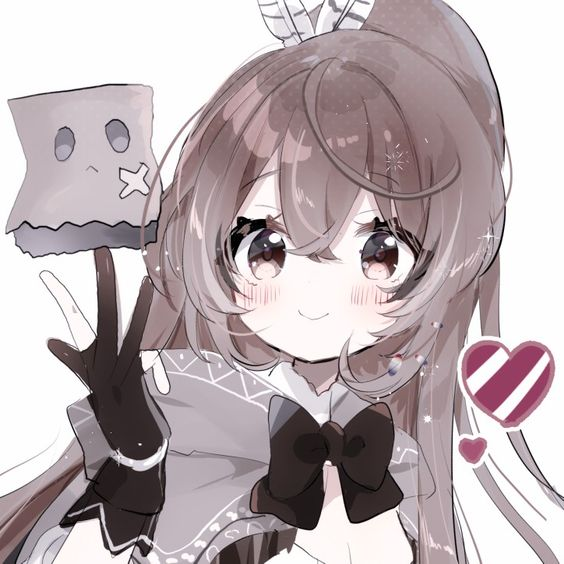

<p align="center">
 
 <h1 align="center">Mumei</h1>
 <h3 align="center">Discord bot for various tasks</h3>
</p>

<p align="center">
 <a href="#overview">Overview</a>,
 <a href="#install">Install</a>
</p>

# Overview

Mumei is [harmony](https://github.com/harmonyland/harmony) bot, made in [Deno](https://deno.land/).

# How to use

## Basic

You can invite bot by [this link](https://discord.com/api/oauth2/authorize?client_id=957161454799314975&scope=bot+applications.commands&permissions=294208515334 ).
Type "/" to see commands!

## Host by yourself

1. Install [deno](https://deno.land/#installation)

1. Set up your [.env](.example.env) (example in [.example.env](.example.env))

```env
TOKEN="YOUR_TOKEN"
BOT_COLOR="COLOR_IN_HEX_(#EBCFC1)"
```

1. Start bot via `deno run --allow-env --allow-net --allow-read mod.ts`

Now you have running bot!
